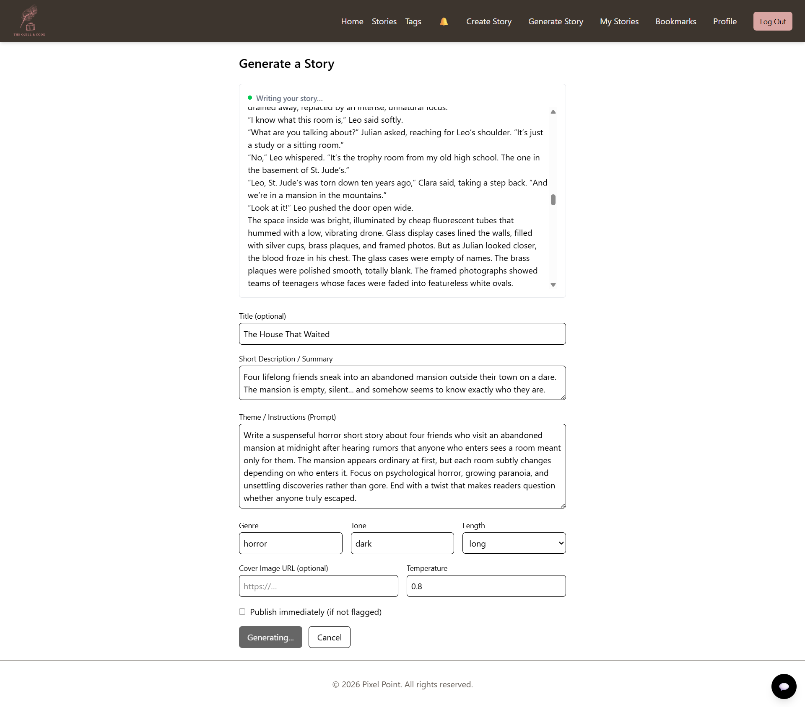
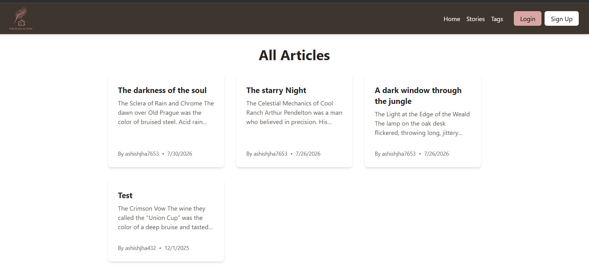
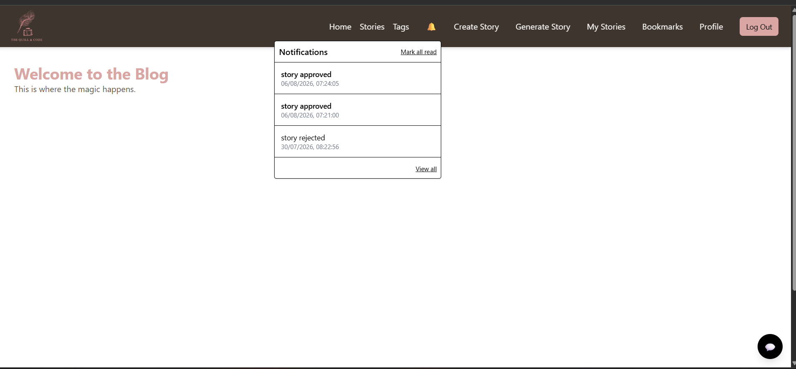
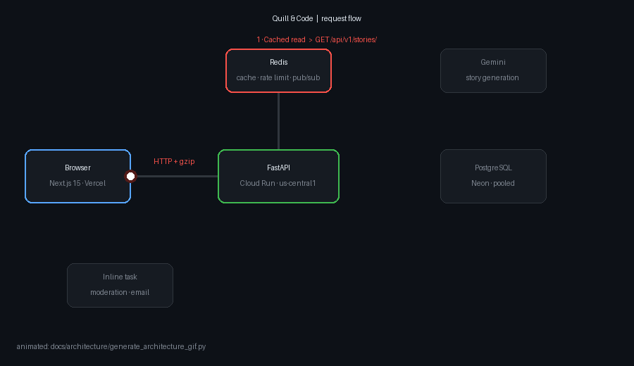
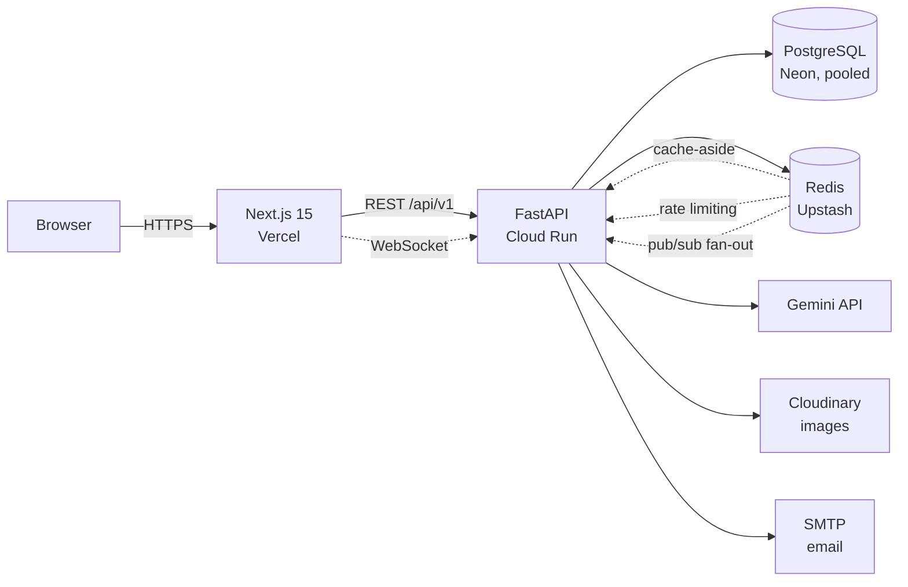
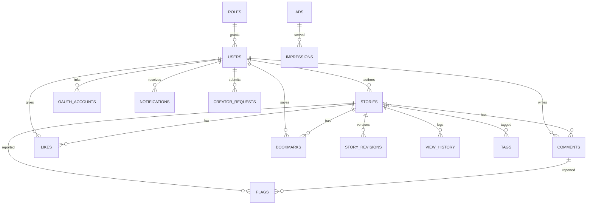
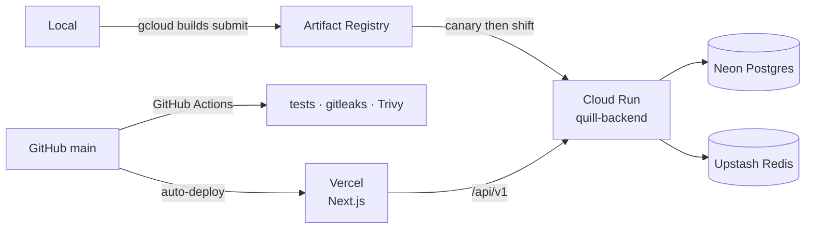

<div align="center">

# Quill & Code

**An AI-assisted blogging platform — write with an LLM, publish through automated moderation, and watch it happen live.**

FastAPI · Next.js 15 · PostgreSQL · Redis · WebSockets · Google Cloud Run · Vercel

[Live demo](https://blog-proj-sooty.vercel.app) · [API docs](https://quill-backend-25ni6nvjaq-uc.a.run.app/docs) · [Backend README](backend/README.md) · [Frontend README](frontend/README.md)

</div>

---

## Project Overview

Quill & Code is a full-stack publishing platform where writers draft with an AI
collaborator, stories pass through automated moderation before going live, and
readers interact in real time.

It is deliberately more than a CRUD blog. The parts worth looking at:

- **Streaming AI generation** — stories are generated token-by-token over
  Server-Sent Events, not delivered as one blocking response.
- **A real authorization system** — a permission enum and a policy layer, not
  `if user.role == "admin"` scattered across routes.
- **Async request path with an explicit transaction boundary** — one unit of work
  per request, with eager loading enforced because async SQLAlchemy has no lazy IO.
- **Live notifications over WebSockets**, with a Redis pub/sub backplane so
  multiple server instances can push to the right client.
- **Postgres full-text search** on a generated `tsvector` column with a GIN index —
  not `LIKE '%term%'`.
- **Measured performance work**: the main list endpoint went from **1.21 s → 0.62 s**
  and **60,924 B → 1,577 B**. See [the case study](docs/performance.md).

## Live Demo

| | |
|---|---|
| **Frontend** | https://blog-proj-sooty.vercel.app |
| **API** | https://quill-backend-25ni6nvjaq-uc.a.run.app |
| **Interactive API docs** | https://quill-backend-25ni6nvjaq-uc.a.run.app/docs |

> **First load may be slow.** The API scales to zero, so a cold start costs a few
> seconds. A scheduled keep-warm ping covers daytime hours (IST); outside that
> window the first request pays the start-up cost. This is a deliberate
> cost trade-off — see [Trade-offs](#trade-offs).

## Screenshots

**AI generation, mid-stream.** The story renders token-by-token as the model
writes it — no spinner, no waiting for a complete response.



| Story feed | Notifications over WebSocket |
|---|---|
|  |  |

| Moderation queue | Story review |
|---|---|
|  |  |

## Features

**Writing & AI**
- Draft, edit, publish, unpublish; soft delete preserves history
- AI story generation from a prompt with genre, tone and length controls
- **Streaming generation** over SSE — watch the story write itself
- Regenerate with feedback, keeping a versioned revision history
- The story's genre becomes its tag automatically, so generated work is
  browsable without asking the author for the same information twice

**Reading & social**
- Home page leads with a **most-loved rail** ranked by likes + comments +
  bookmarks, so good writing isn't buried by whatever was published last
- Story feed with tag and author filters
- **Two pagination modes**: classic offset, and keyset (cursor) for O(1) deep pages
- Full-text search ranked by relevance (title weighted above body)
- Comments, likes, bookmarks
- Server-rendered story pages with OpenGraph metadata, `sitemap.xml`, `robots.txt`

**Moderation & admin**
- Automated profanity moderation on publish; stories land `pending` and flip to
  `published` / `rejected`
- Moderation queue, flag resolution, and an audit log
- Role/permission management, creator-request workflow
- Analytics with window-function daily rollups (posts, users, flags, clicks)
- Ad management with impression and click tracking

**Platform**
- Email + Google OAuth sign-in, email verification, OTP, password reset
- Real-time notifications over WebSockets with a Redis pub/sub backplane
- An LLM support chatbot with conversation history, budget caps, and human escalation
- HMAC-signed outbound webhooks with retries
- RFC 7807 `problem+json` errors, idempotency keys, ETag/`304` conditional GETs

## Architecture Diagram

Three real request paths, animated: a cached read, a write with async
side-effects, and AI streaming.



> Generated by [`docs/architecture/generate_architecture_gif.py`](docs/architecture/generate_architecture_gif.py)
> so it can be regenerated when the architecture changes.

<details>
<summary>Static component diagram</summary>



</details>

## Tech Stack

| Layer | Choice | Why |
|---|---|---|
| API | **FastAPI** | Async-native, and generates the OpenAPI schema the frontend's types are built from |
| ORM | **SQLAlchemy 2.0** (async + sync) | Async for the read path; sync retained for background tasks that must control their own transaction |
| Database | **PostgreSQL** (Neon) | Needed real features — `tsvector` FTS, window functions, JSONB, partial indexes |
| Cache / broker | **Redis** (Upstash) | Cache-aside, rate limiting, idempotency keys, and the WebSocket pub/sub backplane |
| Frontend | **Next.js 15** (App Router) | Server Components for SEO-critical pages, client islands for interactivity |
| Server state | **TanStack Query** | Kills the fetch-in-`useEffect` bug family: races, stale responses, no cleanup |
| Client state | **Zustand** | Small, unopinionated; used only for auth |
| Types | **openapi-typescript** | Frontend types generated from the API schema, so drift is a compile error |
| Jobs | **Celery** | Runs inline in production — see [ADR 001](docs/adr/001-workerless-inline-tasks.md) |
| AI | **Google Gemini** | Streaming support and a usable free tier |
| Hosting | **Cloud Run** + **Vercel** | Both scale to zero; the whole stack is near-free at this traffic level |
| CI | **GitHub Actions** | Backend + frontend tests, E2E, gitleaks, Trivy image scan |

## Why I Built It

Most blogging platforms are either a thin CRUD layer or a hosted product with no
visible internals. I wanted one that had to solve the harder problems a real
content platform runs into: content that must be moderated before it goes live,
search that works on prose rather than substrings, a permission model that holds
up past three roles, and generation that streams so a writer isn't staring at a
spinner for thirty seconds.

The constraint that shaped it most was cost. It runs on free and
near-free tiers, which forced real decisions rather than defaults — scale-to-zero
services, an inline job execution model instead of an always-on worker, and
caching where it actually pays. Every non-obvious decision has a written rationale
in [`docs/adr/`](docs/adr/), including the ones where the cheaper option won and
what that costs in reliability.

## System Design

### Request lifecycle

```
Request
  → CORSMiddleware            (credentialed cross-origin from Vercel)
  → SelectiveGZipMiddleware   (compresses JSON; skips SSE — gzip buffering stalls streams)
  → LoggingMiddleware         (request-id contextvar, propagated into services and tasks)
  → IdempotencyMiddleware     (replays the stored response for a repeated Idempotency-Key)
  → route → service → repository/ORM
  → unit of work commits once, at the dependency seam
```

### Authentication

Short-lived JWT access tokens with **rotating** refresh tokens. Each refresh
blacklists the token it consumed (`jti` in a `token_blacklist` table), so a
replayed token is rejected — which is also how token theft surfaces. The access
token is held **in memory only**; the refresh token is persisted so a reload can
recover the session. See [Trade-offs](#trade-offs).

### Authorization

A `Perm` enum and a role→permission map built bottom-up, so "a moderator can do
everything a creator can" is expressed once rather than repeated:

```
user      → comment:create, comment:delete:own, creator:request
creator   → user − creator:request + story:create, story:update:own,
            story:delete:own, tag:create
moderator → creator + story:moderate, comment:moderate, mod:queue,
            mod:resolve, analytics:view
superadmin→ moderator + admin:users, admin:ads, tag:manage
```

Routes ask `has_perm(user, Perm.X)` or depend on `require(Perm.X)`. Ownership
checks go through `authorize_owned(...)` so "owner **or** moderator" is one
implementation, not one per endpoint.

### Database design



Design points worth noting:

- **`stories.search_vector`** — a `GENERATED ALWAYS ... STORED` tsvector (title
  weighted `A`, body `B`) with a GIN index. Postgres maintains it; the app never
  writes it.
- **`stories.row_version`** — an optimistic-lock column via SQLAlchemy's
  `version_id_col`. A concurrent edit raises `StaleDataError` → `409`, instead of
  silently overwriting. Distinct from `version`, which counts AI revisions.
- **Soft deletes** — `deleted_at`, indexed, and filtered on every read path; a
  deleted author's stories survive with the byline masked at serialisation time.
- **Composite uniques** on `(user_id, story_id)` for likes and bookmarks — the
  database enforces "one like per user per story", not application code.

**Full schema with columns, constraints and indexes:
[backend/README.md → Database design](backend/README.md#database-design)** —
a column-level ER diagram, the constraint table, and every table's purpose.

### Trade-offs

Each of these is a deliberate choice with a cost.

| Decision | Why | What it costs |
|---|---|---|
| **No Celery worker in production**; tasks run inline | A polling consumer can't scale to zero on Cloud Run, so a working worker means an always-on CPU (~$40/mo) | **No retries.** A failed email is lost. → [ADR 001](docs/adr/001-workerless-inline-tasks.md) |
| **Routes mounted at both `/api/v1` and the legacy root** | Lets backend and frontend deploy independently instead of in lockstep | Duplicate route table until the legacy mount is removed |
| **Access token in memory, refresh token in `localStorage`** | The app is split across two domains, so a third-party cookie can't be relied on | An XSS could read the refresh token. Mitigated by rotation + reuse detection |
| **Async reads, sync writes** | Writes enqueue follow-up work that must fire *after* commit; a commit-at-the-end unit of work would race it | Two session styles in one codebase |
| **Cloud Run in `us-central1`** | Free tier and proximity to Neon | ~0.41 s round-trip for users in India — the floor on every request |
| **gzip disabled for SSE** | gzip buffers internally, which stalls token-by-token streaming | Streamed responses aren't compressed (they're small) |

## Folder Structure

```
blog_proj/
├── backend/
│   ├── app/
│   │   ├── routes/         # HTTP layer: validation, status codes, no business logic
│   │   ├── services/       # Business logic; the only layer that touches the ORM
│   │   ├── models/         # SQLAlchemy models
│   │   ├── schemas/        # Pydantic request/response contracts
│   │   ├── authz/          # Perm enum + policy layer (has_perm / require / authorize_owned)
│   │   ├── tasks/          # Celery tasks (run inline in prod — see ADR 001)
│   │   ├── ws/             # WebSocket routes, ticket auth, connection manager
│   │   ├── support/        # LLM support chatbot (WebSocket)
│   │   ├── middleware/     # Logging (request-id), idempotency
│   │   ├── llm/            # Provider adapter — isolates the app from vendor SDKs
│   │   └── core/           # Config, database engines, Redis client
│   ├── alembic/versions/   # Migrations (linear chain)
│   ├── tests/              # 385 tests: unit, integration, property-based, fuzz
│   └── loadtest/           # Locust scenarios (not run in CI)
├── frontend/
│   ├── app/                # Next.js App Router pages
│   ├── components/         # UI components
│   ├── hooks/              # TanStack Query hooks, WebSocket hooks
│   ├── services/           # API client functions
│   ├── lib/                # axios instance + OpenAPI-generated types
│   ├── stores/             # Zustand auth store
│   └── tests/              # Vitest unit/component + Cypress E2E (tests/e2e/)
└── docs/
    ├── adr/                # Architecture decision records
    ├── architecture/       # Animated diagram + its generator
    ├── screenshots/        # Capture checklist
    ├── DEPLOY.md           # Deploy runbook
    └── performance.md          # Latency investigation + measurements
```

## Running Locally

**Prerequisites:** Docker Desktop. Nothing else — Postgres, Redis, the API, the
worker and the frontend all come up in containers.

```bash
git clone https://github.com/AshishJha14411/blog_proj.git
cd blog_proj

# Secrets: fill in at minimum GOOGLE_API_KEY (Gemini) and the ADMIN_* values.
cp .env.example .env
cp backend/.env.example backend/.env

docker compose up -d

# Frontend  -> http://localhost:3000
# API       -> http://localhost:8000
# API docs  -> http://localhost:8000/docs
```

Migrations and an admin user are seeded automatically on first boot (the
entrypoint skips both when `SKIP_MIGRATIONS=true`, which is how production runs
— see [docs/DEPLOY.md](docs/DEPLOY.md)).

Per-service detail — running tests, regenerating types, migrations:
**[backend/README.md](backend/README.md#running-locally)** ·
**[frontend/README.md](frontend/README.md#running-locally)**

### Contributing, and working with AI agents

The repo is set up so a new contributor — human or agent — can be productive
without archaeology:

| | |
|---|---|
| [`CLAUDE.md`](CLAUDE.md) | Working agreement: conventions, guardrails, definition of done. Claude Code loads it automatically; `backend/` and `frontend/` have scoped versions |
| [`docs/DEVELOPMENT.md`](docs/DEVELOPMENT.md) | Setup, daily workflow, the exact commands that work here |
| [`docs/TESTING.md`](docs/TESTING.md) | Test architecture and how to write a regression test that actually proves something |
| [`docs/GOTCHAS.md`](docs/GOTCHAS.md) | Every trap that has already cost debugging time, symptom-first |
| [`docs/adr/`](docs/adr/README.md) | Why things are the way they are |

Full index: **[docs/README.md](docs/README.md)**.

## Deployment



- **Frontend** deploys automatically from `main`. A push to any other branch does
  **not** deploy.
- **Backend** deploys manually: build an image, release it as a **zero-traffic
  canary**, verify it, then shift traffic. This has already caught a boot-crash
  before it reached a user.
- **Migrations run as an explicit deploy step**, not on container start —
  concurrent cold starts would otherwise race the same DDL.

Full runbook, including rollback: **[docs/DEPLOY.md](docs/DEPLOY.md)**.

## API Overview

REST under `/api/v1`, documented at `/docs` (OpenAPI). WebSocket routes are
**top-level** — they are not part of the versioned REST contract.

| Group | Prefix | What it covers |
|---|---|---|
| Auth | `/auth` | Signup, login, refresh rotation, OAuth, email verification, password reset |
| Stories | `/stories` | CRUD, list (offset + keyset), full-text search, AI generation, SSE streaming, publish |
| Comments | `/stories/{id}/comments` | Threaded comments |
| Interactions | `/stories/{id}/like`, `/bookmark` | Toggles and the bookmark list |
| Tags | `/tags` | Tag catalogue and management |
| Moderation | `/moderation` | Flag queue, approve/reject |
| Admin | `/admin` | Users, audit logs, creator requests |
| Analytics | `/analytics` | Daily rollups via window functions |
| Notifications | `/me/notifications` | List, mark read, unread count |
| Ads | `/ads`, `/admin/ads` | Public serving and management |
| Webhooks | `/webhooks` | HMAC-signed outbound endpoints |
| Media | `/media` | Image upload to Cloudinary |
| WebSocket | `/ws` | Ticket mint, notification socket, support chat |

Every endpoint with method, path and required permission:
**[backend/README.md](backend/README.md#api-overview)**.

## Interesting Engineering Problems

The bugs worth reading about — each is *symptom → investigation → root cause → fix → proof*.

### 1. A read request that wrote to the database

Adding an excerpt to list responses looked like a one-liner: `item.content = excerpt`.
It would have **permanently truncated every listed story in Postgres**.

`item` is a live ORM row; assigning a mapped column marks it dirty. The read path
had recently moved to a unit of work that **commits at the end of every request** —
so a plain `GET` would have flushed the truncation.

Worse, the bug was already live in a different form. A helper carried this comment:

```python
def _mask_deleted_authors(items):
    """...never committed, so it can't leak into the database."""   # no longer true
    item.user.username = DELETED_USER_LABEL
```

True when written under a read-only sync session. Silently false once reads became
transactional — and it was overwriting real usernames in production.

**Fix:** `set_committed_value()`, which sets the attribute as if it had been
loaded, producing no history to flush.
**Proof:** `length(content)` in Postgres before and after three list requests —
`67 → 67`, unchanged.

> **The rule:** never assign to a mapped ORM column for display purposes on a
> request path that commits. "In-memory only" stops being true the day someone
> adds a commit, and nothing warns you.

### 2. 30% of a request was transfer, not compute

The story list took 1.21 s. Rather than guessing, I decomposed it against a
control endpoint that touches no database:

```
1.21 s total
├── 0.41 s  network round-trip (measured via GET / — no DB)
├── 0.44 s  server work
└── 0.35 s  transferring 60 KB   ← nobody guesses this
```

Two causes: nothing was compressed, and the list endpoint returned every story's
**full body** to render cards that show three clamped lines.

**Result: 1.21 s → 0.62 s, 60,924 B → 1,577 B.** The naive gzip fix would have
broken SSE streaming (gzip buffers), so compression is applied selectively.
Full write-up: [docs/performance.md](docs/performance.md).

### 3. A 500 that presented as a CORS error

`/auth/refresh` intermittently 500'd, and the browser reported a CORS failure —
which is misleading, because the real fault had nothing to do with CORS.

Refresh rotation checked the blacklist, then inserted the consumed `jti`. Classic
TOCTOU: two refreshes with the same token (parallel tabs, a retry) both passed the
check, and the loser hit the unique index → unhandled `IntegrityError` → **500**.
A 500 escapes before `CORSMiddleware` attaches headers, so the browser saw a
response with no `Access-Control-Allow-Origin` and blamed CORS.

**Fix:** catch `IntegrityError` → `401 "log in again"`, which is also the correct
security response to refresh-token reuse.

### 4. A feature that was dead with zero errors

The support chat silently stopped working. No backend exceptions, no failed
requests in Sentry. Cloud Run logs showed it immediately:

```
POST /ws/ticket          → 200   ✅ notifications
POST /api/v1/ws/ticket   → 404   ❌ chat
```

WebSocket routes are mounted **top-level**, but the chat widget minted its ticket
with a *relative* axios call — which resolved against the client's `/api/v1` base
URL. No ticket, so the socket never opened, and nothing threw.

**Fix:** absolute URL. **Lesson:** after a URL-prefix migration, grep for every
caller of routes that *didn't* move.

### 5. asyncpg behind a connection pooler

Moving reads to async meant `asyncpg`, which uses server-side prepared statements.
Neon's pooled endpoint is PgBouncer in transaction mode, which cannot support
them — every async endpoint would have failed in production.

This is invisible locally (no pooler in front of local Postgres), so no test could
catch it. It was caught by deploying to a **zero-traffic canary** and exercising
it against the real pooled database before shifting any users.

## Lessons Learned

- **Measure before optimising, and measure a control.** The transfer-time finding
  was invisible without an endpoint that does nothing to compare against.
- **A comment is not an invariant.** `"never committed"` was accurate when written
  and became dangerous when the transaction boundary changed. If correctness
  depends on it, assert it in a test.
- **Deploy in a way that lets you be wrong.** The canary caught a boot-crash and a
  pooler incompatibility with zero user impact. It costs one extra command.
- **Errors that reach the browser get reshaped.** A 500 became a "CORS error"
  because middleware ordering decides which headers survive. Read the server log,
  not the browser's interpretation.
- **Cost is a design constraint.** A budget ceiling ruled out the default answer
  (an always-on worker) and forced an explicit decision with a written cost in
  reliability, rather than an unexamined default.
- **Silence is a failure mode.** The dead chat and the un-drained queue both
  produced no errors. Features that fail quietly need an explicit health signal.

## Future Improvements

Ordered by impact:

1. **Cloud Tasks for background work** — restores retries and async execution
   while keeping scale-to-zero. Strictly better than both the current inline
   approach and an always-on worker, and free at this volume.
2. **Resend-verification endpoint** — the current gap that actually hurts users:
   inline email has no retry, and there's no way to request another.
3. **Speed up search** — `/stories/search` is now the slowest endpoint (~2.3 s);
   it is uncached and the `ts_rank` ordering needs review.
4. **Retire the legacy route mount** once access logs show no unversioned traffic.
5. **Move closer to users or add an edge cache** — ~0.41 s of every request is
   geography.
6. **Frontend performance pass** — the remaining slowness is likely client-side
   fetch waterfalls rather than the API.
7. **OAuth2 PKCE** and a parameterised endpoint × role authorization test matrix.

---

<div align="center">

Built by **[Ashish Kr Jha](https://github.com/AshishJha14411)** ·
[Backend](backend/README.md) · [Frontend](frontend/README.md) · [Deploy runbook](docs/DEPLOY.md)

</div>
