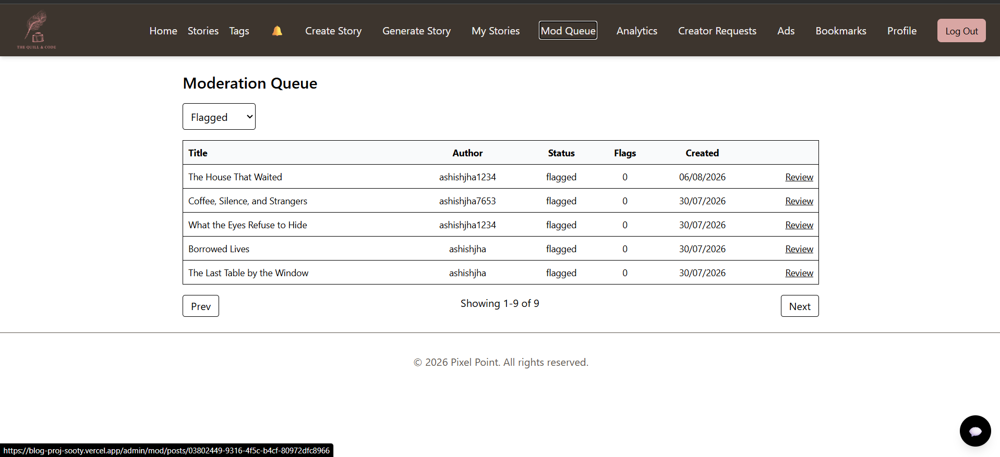
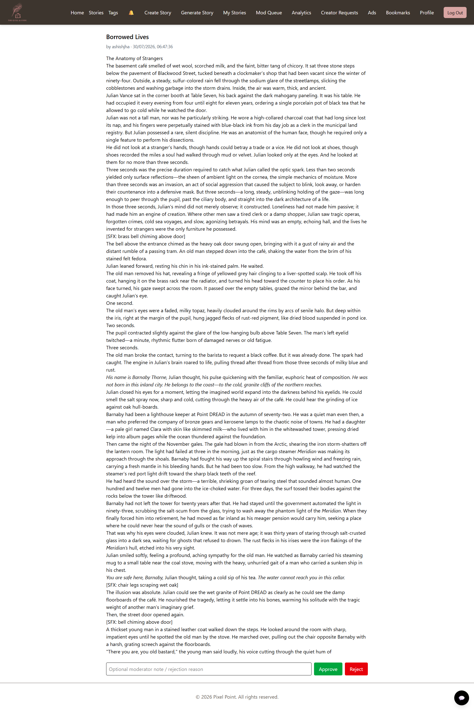
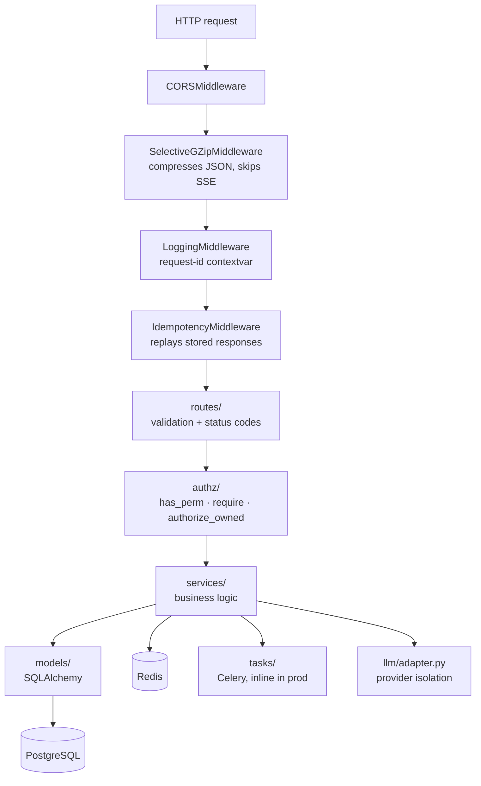
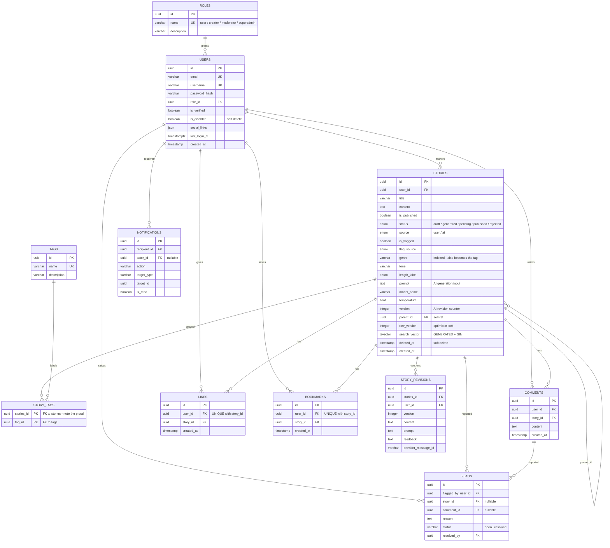

# Quill & Code — Backend

FastAPI service powering [Quill & Code](../README.md): REST API, WebSocket
real-time layer, AI story generation, automated moderation, and an
authorization system built on permissions rather than role-name checks.

**[← Project overview](../README.md)** · **[Frontend](../frontend/README.md)** · **[Deploy runbook](../docs/DEPLOY.md)**

---

## Project Overview

A Python 3.12 / FastAPI application with:

- **Async request path** on SQLAlchemy 2.0 with a single explicit transaction
  boundary per request
- **Permission-based authorization** — a `Perm` enum and a policy layer, never
  `if user.role == "admin"`
- **Postgres-native features**: `tsvector` full-text search, window-function
  analytics, JSONB, partial and composite indexes, optimistic locking
- **Streaming AI generation** over Server-Sent Events
- **WebSockets** with ticket-based auth and a Redis pub/sub backplane
- **403 tests** — unit, integration, property-based (Hypothesis), and fuzz

## Live Demo

| | |
|---|---|
| API root | https://quill-backend-25ni6nvjaq-uc.a.run.app |
| **Swagger UI** | https://quill-backend-25ni6nvjaq-uc.a.run.app/docs |
| OpenAPI schema | https://quill-backend-25ni6nvjaq-uc.a.run.app/openapi.json |
| Prometheus metrics | `/metrics` |

> `/healthz` exists and works **inside** the container, but Cloud Run's ingress
> reserves that path and answers it itself — so it is not reachable publicly.
> Use `/` for external liveness checks.

## Screenshots

The moderation pipeline this API drives — a story enters `pending`, automated
screening runs, and a moderator resolves it:

| Moderation queue | Story review |
|---|---|
|  |  |

Interactive API documentation is live at
[`/docs`](https://quill-backend-25ni6nvjaq-uc.a.run.app/docs).

Every error in the API speaks one dialect — RFC 7807 `problem+json`:

```json
{
  "type": "https://quillandcode.dev/errors/404",
  "title": "Not Found",
  "status": 404,
  "detail": "Story not found",
  "instance": "/api/v1/stories/00000000-0000-0000-0000-000000000000"
}
```

## Features

- **Auth** — JWT access tokens, rotating refresh tokens with reuse detection,
  Google OAuth, email verification, OTP, password reset
- **Stories** — CRUD, soft delete, offset **and** keyset pagination, full-text
  search, AI generation (blocking + streaming), versioned revisions
- **Moderation** — automated profanity screening on publish, flag queue,
  approve/reject with audit trail
- **Social** — comments, likes, bookmarks (uniqueness enforced by the database)
- **Real-time** — notification WebSocket + LLM support chat, both ticket-authed
- **Platform** — RFC 7807 errors, idempotency keys, ETag/`304`, HMAC-signed
  webhooks with retries, structured JSON logs with a request-id, Prometheus metrics

## Architecture Diagram



**Middleware order is deliberate** (added innermost-first, so the outermost wraps
everything):

1. `CORSMiddleware` — outermost, so cross-origin headers are attached last
2. `SelectiveGZipMiddleware` — compresses JSON; **skips any path containing
   `/stream`** because gzip buffers internally and would stall SSE
3. `LoggingMiddleware` — assigns the request-id that propagates into services and tasks
4. `IdempotencyMiddleware` — innermost, so a replayed response is still logged

> One caveat this ordering exposes: an *unhandled* 500 escapes before CORS
> attaches headers, so the browser reports it as a CORS error. See
> [Interesting Engineering Problems](#interesting-engineering-problems).

## Tech Stack

| Concern | Choice |
|---|---|
| Framework | FastAPI 0.140 · Starlette 1.3 · Uvicorn |
| ORM | SQLAlchemy 2.0 — **asyncpg** (request path) + **psycopg2** (tasks/migrations) |
| Database | PostgreSQL 16 (Neon in production) |
| Migrations | Alembic |
| Cache / broker | Redis 7 (Upstash in production) |
| Jobs | Celery 5.4 — inline in production ([ADR 001](../docs/adr/001-workerless-inline-tasks.md)) |
| Auth | python-jose (JWT) · passlib + bcrypt |
| AI | Google Gemini (`gemini-flash-lite-latest`) via an adapter in `app/llm/` — flash-lite over flash for latency, see [GOTCHAS](../docs/GOTCHAS.md) |
| Validation | Pydantic v2 · pydantic-settings |
| Observability | Structured JSON logs · Sentry · prometheus-fastapi-instrumentator |
| Testing | pytest · Hypothesis · fakeredis · factory-boy · Locust |

## Why I Built It

The backend carries the parts of a content platform that are easy to do badly:
deciding what may be published before it goes live, searching prose rather than
matching substrings, granting permissions in a way that survives a fifth role, and
streaming a slow LLM response so the writer isn't blocked on it.

It also runs under a hard cost ceiling, which ruled out the comfortable defaults —
no always-on worker, no provisioned instances, and caching only where it measurably
pays. Those constraints are documented as decisions in [`../docs/adr/`](../docs/adr/)
rather than left implicit.

## System Design

### Transaction boundary

The async DB dependency owns the transaction. Services **stage** work; the seam
decides the outcome:

```python
async def get_async_db():
    async with AsyncSessionLocal() as session:
        try:
            yield session
            await session.commit()      # one commit per request
        except Exception:
            await session.rollback()
            raise
```

Two consequences that are easy to miss:

- **No lazy loading.** Async SQLAlchemy cannot emit IO on attribute access, so
  every relationship a response touches must be eager-loaded
  (`joinedload` / `selectinload`) or it raises `MissingGreenlet` at runtime.
- **Reads commit too.** Any in-memory mutation of a mapped column on a read path
  gets flushed. Display-only overrides must use `set_committed_value()`.

### Async reads, sync writes

Reads are async; writes stay on the sync session. This is deliberate: writes
enqueue follow-up work that must fire **after** the row is committed, and a
commit-at-the-end unit of work would race it. Both engines target the same
database and coexist — FastAPI runs sync routes in a threadpool.

### Concurrency control

- **Uniqueness is arbitrated by the database, not a pre-check.** Signup catches
  `IntegrityError` → `409`. A `SELECT`-then-`INSERT` check is a TOCTOU window,
  not a lock.
- **Optimistic locking** on stories via `row_version` (`version_id_col`). A
  concurrent edit raises `StaleDataError` → `409 "refresh and retry"` rather than
  silently overwriting.
- **Idempotency keys** on unsafe POSTs, stored in Redis (`SET NX`), so a retried
  request replays the original response instead of acting twice.

### Caching

- **Cache-aside** on anonymous story lists only. Authenticated responses embed
  per-user like/bookmark flags, so caching them would leak state between users.
- **ETag + `If-None-Match` → `304`** on read endpoints, with
  `Cache-Control: private, no-cache` — revalidation is allowed, shared reuse isn't.
- Invalidated on any story create/update/delete/publish.

### Database design

#### Core schema

The content graph, with columns. Reproduced from the live database, not from
the models — the two agree, but the database is the authority.

Two omissions, both for readability: peripheral tables (ads, webhooks,
audit/error logs, credential tables) are summarised in the table below rather
than drawn, and `users`/`stories` show their meaningful columns rather than
every one — the denormalised counters (`total_posts`, `total_likes`,
`total_comments`) and audit timestamps are left out. Nothing shown here is
approximate: every column, type and constraint below was read back from
production.



**Constraints that carry real weight** (verified against production):

| Constraint | Where | Why it exists |
|---|---|---|
| `UNIQUE (user_id, story_id)` | `likes`, `bookmarks` | "One like per user per story" is enforced by the database, not by a read-then-write in application code that two concurrent requests can both pass |
| `UNIQUE (provider, subject)` | `oauth_accounts` | One Google identity maps to exactly one account |
| `UNIQUE (jti)` | `token_blacklist` | The arbiter for refresh-token rotation — the loser of a concurrent refresh hits this index and gets a `401` instead of both requests succeeding |
| `PRIMARY KEY (stories_id, tag_id)` | `story_tags` | Composite PK; a story can't carry the same tag twice |
| `UNIQUE (name)` | `tags` | Tag names are cleaned before insert so casing alone can't create a near-duplicate row |
| `UNIQUE (email)`, `UNIQUE (username)` | `users` | Unique **indexes** rather than table constraints — `information_schema.table_constraints` won't show them; check `pg_indexes` |

**Indexes on `stories`:** `search_vector` (GIN), plus btree on `user_id`,
`status`, `source`, `is_published`, `deleted_at`, `genre`, `tone`.

> **Naming inconsistency, deliberately left alone:** `story_tags` and
> `story_revisions` use **`stories_id`** where every other table uses
> `story_id`. It follows the table name rather than the entity. Renaming it
> would be a migration plus a code sweep for no functional gain, so it's
> documented instead of quietly fixed — worth knowing before writing raw SQL
> against either table.

#### All tables

| Table | Purpose | Notable |
|---|---|---|
| `users` | Accounts | unique `email`/`username`; `is_disabled` soft delete; FK → `roles` |
| `roles` | Role catalogue | `user`, `creator`, `moderator`, `superadmin` |
| `stories` | Core content | `search_vector` (generated tsvector + GIN), `row_version` (optimistic lock), `deleted_at` (soft delete), self-FK `parent_id` for revisions, enums for `status`/`source`/`length_label` |
| `tags` / `story_tags` | Tagging | many-to-many, composite PK |
| `comments` | Comments | FK → users, stories |
| `likes` / `bookmarks` | Interactions | **composite unique `(user_id, story_id)`** — DB-enforced |
| `story_revisions` | AI revision history | version + prompt + feedback per revision |
| `flags` | Reports | targets a story **or** a comment; `status` open/resolved |
| `notifications` | In-app notifications | `recipient_id` CASCADE, indexed `is_read` |
| `oauth_accounts` | Google identities | composite unique `(provider, subject)` |
| `otp_verifications`, `password_reset_tokens` | Short-lived credentials | single-use + expiry |
| `token_blacklist` | Revoked refresh tokens | unique indexed `jti` — the refresh-rotation arbiter |
| `webhook_endpoints` | Outbound webhooks | JSONB `event_types`, HMAC `secret`, failure counter |
| `ads` / `impressions` / `clicks` | Ad serving | polymorphic click target |
| `view_history` | Story views | nullable `user_id` (anonymous views) |
| `audit_logs` | Admin audit trail | before/after JSON state |
| `error_logs` | Deduped errors | unique `error_hash` + occurrence `count` |
| `analytics_cache` | Daily rollups | unique `day` |
| `creator_requests` | Creator applications | one per user (unique `user_id`) |

**Migrations** — a linear chain, no branches:

```
ea6ae513e2d6  baseline schema
  → a1b2c3d4e5f6  FK + hot-path indexes
  → b2c3d4e5f6a7  add `pending` to storystatus enum
  → c3d4e5f6a7b8  webhook_endpoints table
  → d4e5f6a7b8c9  full-text search (generated tsvector + GIN, CONCURRENTLY)
  → e5f6a7b8c9d0  optimistic-lock counter        [head]
```

The FTS migration builds its index with `CREATE INDEX CONCURRENTLY` inside
`op.get_context().autocommit_block()` — a plain `CREATE INDEX` takes a write lock
for the duration of the build.

### Trade-offs

See the [project-level table](../README.md#trade-offs). Backend-specific:

- **`psycopg2` and `asyncpg` both installed** — async needs asyncpg; Alembic and
  Celery need a sync driver.
- **`statement_cache_size=0` when the URL is pooled** — asyncpg's prepared
  statements are incompatible with PgBouncer transaction pooling.
- **Migrations do not run on container start** — `SKIP_MIGRATIONS=true` in
  production. Concurrent cold starts would otherwise race the same DDL, and it
  added ~10 s to every cold start.

## Folder Structure

```
backend/
├── app/
│   ├── main.py             # App assembly, middleware order, router mounting
│   ├── dependencies.py     # DI: sync + async sessions, current-user resolution
│   ├── routes/             # HTTP layer — thin; no business logic
│   ├── services/           # Business logic; the only layer touching the ORM
│   ├── models/             # SQLAlchemy models
│   ├── schemas/            # Pydantic contracts (also the OpenAPI source of truth)
│   ├── authz/
│   │   ├── permissions.py  # Perm enum + ROLE_PERMS, built bottom-up
│   │   └── policy.py       # has_perm · require · authorize_owned
│   ├── tasks/              # Celery: email, moderation, webhook delivery, support
│   ├── ws/                 # WebSocket routes, ticket auth, connection manager
│   ├── support/            # LLM support chatbot
│   ├── middleware/         # logging (request-id), idempotency
│   ├── llm/adapter.py      # Provider isolation — swap Gemini without touching services
│   ├── utils/              # http_cache (ETag), rate limiter, cache, security
│   ├── core/               # config, database engines, redis client
│   └── observability.py    # JSON logging, Sentry, Prometheus
├── alembic/versions/       # Migrations
├── tests/                  # unit · integration · property-based · fuzz
├── loadtest/locustfile.py  # p95-at-RPS scenarios (not in CI)
└── Dockerfile              # multi-stage, non-root, HEALTHCHECK
```

## Running Locally

From the **repository root** (not `backend/`):

```bash
cp .env.example .env
cp backend/.env.example backend/.env      # set GOOGLE_API_KEY + ADMIN_* at minimum
docker compose up -d

curl http://localhost:8000/            # {"msg":"It works!"}
open http://localhost:8000/docs
```

Migrations and the admin seed run automatically on first boot locally
(`SKIP_MIGRATIONS` is unset in `docker-compose.yml`).

### Tests

The suite runs **inside the container** against a dedicated database:

```bash
# One-time: create the test database
docker compose exec db psql -U test_user -d test_db -c "CREATE DATABASE quill_test"

# Copy the tests in. NOTE: remove as root — the container runs as a non-root
# user and cannot delete root-owned files left by a previous `docker compose cp`.
docker compose exec --user root backend sh -c 'rm -rf /app/tests'
docker compose cp ./backend/tests backend:/app/tests

docker compose exec \
  -e TEST_DB_BASE="postgresql://test_user:test_password@db:5432/quill_test" \
  -e NO_NETWORK=0 \
  backend python -m pytest tests/ -m "not e2e"
# 403 passed
```

`TEST_DB_BASE` is overridden because the suite defaults to `localhost` (correct in
CI, wrong inside a container where Postgres is the `db` service). `NO_NETWORK=0`
lifts the socket guard that otherwise blocks non-localhost connections.

### Migrations

```bash
# New migration
docker compose exec backend python -m alembic revision -m "describe change"

# Apply / inspect
docker compose exec backend python -m alembic upgrade head
docker compose exec backend python -m alembic current
```

⚠ **Never run migrations without pinning `MIGRATION_DATABASE_URL`.**
`backend/.env` points at production; `docker-compose.yml` overrides it to the
local database. Getting this wrong once applied a migration to production.

### Load test

```bash
pip install -r backend/loadtest/requirements.txt
locust -f backend/loadtest/locustfile.py --host http://localhost:8000
```

## Deployment

Cloud Run, deployed manually as a **zero-traffic canary** first:

```bash
gcloud builds submit backend/ --tag .../backend-repo/api:vNN
gcloud run deploy quill-backend --image .../api:vNN --no-traffic --tag=canary
# verify against https://canary---<service-url>
gcloud run services update-traffic quill-backend --to-latest
```

Key production settings:

| Setting | Value | Why |
|---|---|---|
| `min-instances` | 0 | Scale to zero; a keep-warm ping covers viewing hours |
| CPU throttling | on (default) | Billed only while handling a request |
| `SKIP_MIGRATIONS` | `true` | Migrations are a deploy step, not a boot step |
| `CELERY_TASK_ALWAYS_EAGER` | `true` | No worker; tasks run inline ([ADR 001](../docs/adr/001-workerless-inline-tasks.md)) |
| `DATABASE_URL` | Neon **pooled** | Serverless × Postgres connection exhaustion is the classic incident |
| `MIGRATION_DATABASE_URL` | Neon **direct** | PgBouncer transaction mode breaks Alembic's advisory locks |

Full runbook including rollback: **[../docs/DEPLOY.md](../docs/DEPLOY.md)**.

## API Overview

All REST routers are mounted **twice**: canonically under `/api/v1/*` (what
OpenAPI documents), and temporarily at the legacy top level with
`include_in_schema=False` so the frontend can migrate independently.
**WebSocket routes are top-level only** and are not versioned.

Auth column: 🔓 public · 🔑 any authenticated user · 🛡 requires a permission.

### Auth — `/auth`
| Method | Path | Description | Auth |
|---|---|---|---|
| POST | `/signup` | Create account, send verification + OTP | 🔓 rate-limited |
| POST | `/login` | Password login; sets refresh cookie | 🔓 rate-limited |
| POST | `/logout` | Revoke refresh token, clear cookie | 🔓 (token is the credential) |
| POST | `/refresh` | Rotate refresh token (body **or** cookie) | 🔓 |
| GET | `/verify-email` | Verify via emailed token | 🔓 |
| POST | `/verify-otp` | Verify signup OTP | 🔓 |
| GET | `/me` | Current user profile | 🔑 |
| PATCH | `/me` | Update profile | 🔑 |
| POST | `/me/avatar` | Upload avatar to Cloudinary | 🔑 |
| PATCH | `/me/password` | Change password | 🔑 |
| POST | `/forgot-password` | Email a reset link | 🔓 rate-limited |
| POST | `/reset-password` | Consume reset token | 🔓 |
| GET | `/google/login` | Start Google OAuth | 🔓 |
| GET | `/google/callback` | OAuth callback → redirect to frontend | 🔓 |

### Stories — `/stories`
| Method | Path | Description | Auth |
|---|---|---|---|
| POST | `/` | Create a story | 🛡 `story:create` |
| GET | `/` | List — offset **or** keyset `cursor`; filters `tag`, `author_id`; ETag | 🔓 optional auth |
| GET | `/search` | Full-text search, relevance-ranked | 🔓 optional auth |
| GET | `/popular` | Most-engaged stories (likes + comments + bookmarks) | 🔓 optional auth |
| GET | `/me` | The caller's own stories | 🔑 |
| GET | `/{story_id}` | Story detail; ETag/`304` | 🔓 optional auth |
| PATCH | `/{story_id}` | Update (optimistic-locked) | 🔑 owner or moderator |
| DELETE | `/{story_id}` | Soft delete | 🔑 owner or moderator |
| POST | `/generate` | AI generation (blocking) | 🛡 `story:create` |
| POST | `/generate/stream` | **SSE** streaming generation | 🛡 `story:create` |
| POST | `/{story_id}/feedback` | Regenerate with feedback | 🔑 owner |
| POST | `/{story_id}/publish` | Publish (queues moderation) | 🔑 owner |
| POST | `/{story_id}/unpublish` | Unpublish | 🔑 owner |

### Comments · Interactions — *no prefix*
| Method | Path | Description | Auth |
|---|---|---|---|
| POST | `/stories/{story_id}/comments` | Add a comment | 🔑 rate-limited |
| GET | `/stories/{story_id}/comments` | List comments (paginated) | 🔓 |
| DELETE | `/comments/{comment_id}` | Delete a comment | 🔑 owner or moderator |
| POST | `/stories/{story_id}/like` | Toggle like | 🔑 |
| POST | `/stories/{story_id}/bookmark` | Toggle bookmark | 🔑 |
| GET | `/users/me/bookmarks` | Bookmarked stories | 🔑 |

### Moderation — `/moderation` (+ flagging, no prefix)
| Method | Path | Description | Auth |
|---|---|---|---|
| GET | `/moderation/flags` | Open flags | 🛡 `mod:queue` |
| PATCH | `/moderation/flags/{flag_id}` | Resolve a flag | 🛡 `mod:queue` |
| GET | `/moderation/queue` | Moderation queue | 🛡 `mod:queue` |
| POST | `/moderation/stories/{story_id}/approve` | Approve, close flags | 🛡 `mod:queue` |
| POST | `/moderation/stories/{story_id}/reject` | Reject with reason | 🛡 `mod:queue` |
| POST | `/stories/{story_id}/flag` | Report a story | 🔑 rate-limited |
| POST | `/comments/{comment_id}/flag` | Report a comment | 🔑 rate-limited |

### Tags · Notifications · Media · Webhooks
| Method | Path | Description | Auth |
|---|---|---|---|
| GET | `/tags/` | List tags | 🔓 |
| POST | `/tags/` | Create tag | 🛡 `tag:create` |
| PATCH | `/tags/{tag_id}` | Update tag | 🛡 `tag:manage` |
| DELETE | `/tags/{tag_id}` | Delete tag | 🛡 `tag:manage` |
| GET | `/me/notifications/` | List (optional `unread_only`) | 🔑 |
| POST | `/me/notifications/{id}/read` | Mark one read | 🔑 |
| POST | `/me/notifications/read_all` | Mark all read | 🔑 |
| GET | `/me/notifications/unread_count` | Unread badge count | 🔑 |
| POST | `/media/upload` | Upload an image | 🔑 |
| POST | `/webhooks` | Register endpoint — **returns the secret once** | 🔑 |
| GET | `/webhooks` | List endpoints (never returns secrets) | 🔑 |
| DELETE | `/webhooks/{endpoint_id}` | Remove endpoint | 🔑 |

### Admin · Analytics · Ads
| Method | Path | Description | Auth |
|---|---|---|---|
| GET | `/admin/users/` | List users | 🛡 `admin:users` |
| PATCH | `/admin/users/{user_id}` | Change role / disable | 🛡 `admin:users` |
| DELETE | `/admin/users/{user_id}` | Soft-delete user | 🛡 `admin:users` |
| GET | `/admin/audit-logs/` | Audit log | 🛡 `admin:users` |
| POST | `/admin/creator-requests` | Apply to become a creator | 🔑 |
| GET | `/admin/creator-requests/pending` | Pending applications | 🛡 `mod:queue` |
| POST | `/admin/creator-requests/{id}/review` | Approve / reject | 🛡 `mod:queue` |
| GET | `/analytics/posts/daily` · `/users/daily` · `/flags` · `/moderation` · `/clicks` | Daily rollups (window functions) | 🛡 `analytics:view` |
| GET | `/ads/` · `/ads/{ad_id}` | Public ad serving | 🔓 |
| POST/PATCH/DELETE | `/admin/ads/...` | Ad management | 🛡 `admin:ads` |

### WebSocket — `/ws` *(top-level, unversioned)*
| Method | Path | Description |
|---|---|---|
| POST | `/ws/ticket` | Mint a single-use 30 s ticket for the handshake | 🔑 rate-limited |
| WS | `/ws/notifications` | Live notifications; 25 s heartbeat; closes `4401` on auth failure |
| WS | `/ws/support` | LLM support chat — streaming replies, history, budget cap, human escalation |

> Tickets exist so the token never appears in a URL (WebSocket handshakes can't
> carry an `Authorization` header). Because `/ws/*` is **not** under `/api/v1`,
> clients must call it with an absolute URL — see
> [problem #4](#interesting-engineering-problems).

## Interesting Engineering Problems

Full write-ups in the [project README](../README.md#interesting-engineering-problems).
Backend-specific summaries:

**A read request that wrote to the database.** `_mask_deleted_authors` assigned a
mapped ORM column with a docstring promising it was "never committed" — true under
the old read-only sync session, silently false once reads became a commit-at-end
unit of work. It was overwriting usernames in production. Fixed with
`set_committed_value()`; verified by asserting `length(content)` before and after
read requests.

**Thirty percent of a request was transfer.** Decomposing latency against a no-op
control endpoint showed 0.35 s of a 1.21 s request was shipping 60 KB — no
compression, and list endpoints returning full article bodies. → **0.62 s / 1.6 KB**.
[Case study](../docs/performance.md).

**A 500 that presented as a CORS error.** Refresh rotation had a TOCTOU window
between the blacklist check and the `jti` insert; the loser hit the unique index →
unhandled `IntegrityError` → 500. A 500 escapes before `CORSMiddleware` attaches
headers, so the browser blamed CORS. Fixed by catching `IntegrityError` → `401`.

**asyncpg behind PgBouncer.** Prepared statements are incompatible with
transaction pooling — invisible locally, fatal in production. Caught by a
zero-traffic canary; fixed with `statement_cache_size=0` when the URL is pooled.

**A fuzz test that found two real bugs.** Hypothesis throwing hostile input at the
read surface found (a) full-text search 500'd on a NUL byte, and (b) FTS was never
actually exercised by any test — the test fixture builds tables from ORM models,
and `search_vector` exists only in a migration.

## Lessons Learned

- **Async is not a drop-in.** No lazy loading, and the transaction boundary
  becomes something you must design rather than inherit.
- **Let the database enforce invariants.** Unique constraints and version columns
  are correct under concurrency; `SELECT`-then-`INSERT` is not.
- **Comments decay into lies.** If correctness depends on an invariant, assert it
  in a test — the "never committed" comment was true for months before it wasn't.
- **Fuzz the boundary.** Two real bugs surfaced in a single Hypothesis run that
  hundreds of example-based tests had missed.
- **Canary deploys pay for themselves immediately.** Two production-breaking
  changes were caught with zero user impact.

## Future Improvements

1. **Cloud Tasks** for background work — restores retries while keeping
   scale-to-zero, and is free at this volume
2. **Resend-verification endpoint** — inline email has no retry, and a lost
   verification email currently strands the user
3. **Speed up `/stories/search`** (~2.3 s) — uncached; review the `ts_rank` plan
   with `EXPLAIN ANALYZE`
4. **Remove the legacy route mount** once logs show no unversioned traffic
5. **OAuth2 PKCE**, and a parameterised endpoint × role authorization test matrix
6. **`EXPLAIN ANALYZE` pass** over the analytics rollups and a PITR restore drill
