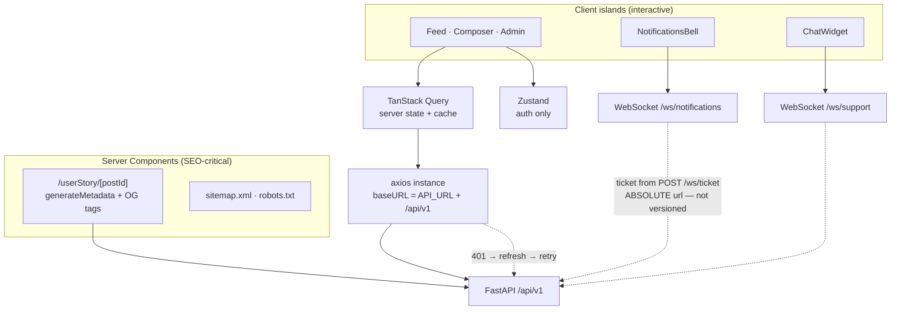

# Quill & Code — Frontend

Next.js 15 application for [Quill & Code](../README.md): server-rendered reading
pages for SEO, interactive client islands for writing, and a real-time layer for
notifications and support chat.

**[← Project overview](../README.md)** · **[Backend](../backend/README.md)**

---

## Project Overview

A React 19 / Next.js 15 App Router application built around three ideas:

- **Server Components for anything that must be indexable.** Story pages render
  on the server with real OpenGraph metadata, so a shared link previews correctly
  and search engines see content rather than an empty shell.
- **Server state is not component state.** All API data goes through TanStack
  Query, which removes the fetch-in-`useEffect` bug family — request races, stale
  responses overwriting fresh ones, missing cleanup on unmount.
- **Types come from the API, not from hand-written interfaces.** `lib/api-types.ts`
  is generated from the backend's OpenAPI schema, so a backend contract change
  becomes a TypeScript error rather than a runtime surprise.

## Live Demo

| | |
|---|---|
| **Application** | https://blog-proj-sooty.vercel.app |
| API it talks to | https://quill-backend-25ni6nvjaq-uc.a.run.app |

## Screenshots

**AI generation streaming into the editor** — the composer renders deltas as they
arrive over SSE rather than waiting for the full response.


| Story feed (Server Component) | Notification dropdown |
|---|---|
|  |  |

## Features

**Reading**
- Story feed with tag and author filters, and relevance-ranked search
- Server-rendered story pages with OpenGraph/Twitter metadata, `sitemap.xml`, `robots.txt`
- Comments, likes, bookmarks with optimistic UI

**Writing**
- Rich story composer with tag input
- AI generation with genre / tone / length controls
- **Live streaming preview** — the story renders token-by-token as it generates
- Regenerate with feedback; publish / unpublish

**Real-time**
- Notification bell fed by a WebSocket, falling back to polling if the socket degrades
- Support chat widget with streaming replies and human escalation

**Admin**
- Moderation queue and per-story review
- Analytics dashboards, ad management, creator-request review

**Account**
- Email + Google sign-in, verification, OTP, password reset, profile with avatar upload

## Architecture Diagram



**Rendering split:** anything a crawler or a link preview needs is a Server
Component; anything interactive is a client island. The story page is the clearest
example — the page itself is server-rendered for metadata, and the interactive
body (likes, comments, actions) is extracted into `StoryDetailClient.tsx`.

## Tech Stack

| Concern | Choice | Why |
|---|---|---|
| Framework | Next.js 15 (App Router) · React 19 | Server Components where SEO matters |
| Server state | TanStack Query | Caching, invalidation-on-mutation, no manual loading flags |
| Client state | Zustand (+ `persist`) | Auth only; deliberately not a global data store |
| HTTP | axios | One instance carries auth + the refresh interceptor |
| Types | openapi-typescript | Generated from the API schema — drift is a compile error |
| Sanitising | isomorphic-dompurify | Story bodies are HTML and must be sanitised on both server and client |
| UI | Tailwind CSS · Radix Slot | Utility styling, accessible primitives |
| Tests | Vitest + Testing Library · Cypress | 89 unit/component tests; E2E in `tests/e2e/` |

## Why I Built It

A publishing product lives or dies on whether its pages can be found and shared,
so the interesting frontend problem here was not the UI — it was deciding what
must render on the server and what can stay on the client, without ending up with
two rendering models fighting each other.

The second problem was data freshness: a notification badge, a story list, and a
moderation queue all read the same underlying state, and keeping them consistent
by hand is where bugs breed. Pushing all of it into a single query cache with
explicit invalidation made whole classes of staleness bug impossible to express.

## System Design

### State: two stores, clear boundary

| Concern | Owner | Reason |
|---|---|---|
| API data (stories, comments, notifications) | **TanStack Query** | It's server state — it needs caching, revalidation and invalidation, not `useState` |
| Auth session (tokens, current user) | **Zustand** + `persist` | Client state, synchronously readable by the axios interceptor |

Mutations invalidate rather than hand-patch. Marking a notification read
invalidates the `["notifications", …]` key, so the bell badge and the
notifications page both update from one call.

### Auth token strategy

| Token | Stored | Why |
|---|---|---|
| **Access** | Memory only (excluded from `persist`) | Short-lived; keeping it out of `localStorage` limits what an XSS can exfiltrate |
| **Refresh** | `localStorage` | The app and API are on different domains, so a third-party cookie can't be relied on for session recovery |

Refresh tokens **rotate** — each refresh invalidates the one it consumed. Because
`localStorage` is shared across tabs but each tab holds its own in-memory copy, a
`storage` event listener re-hydrates the store so no tab is left holding a revoked
token.

### Design system and theming

There is **no `tailwind.config.js`**. This is Tailwind v4, configured CSS-first:
design tokens are declared in an `@theme` block in `app/globals.css`, and that
file is the single source of truth for the visual language.

```css
:root  { --page-background: #FDFBF8;  --accent-primary: #D9A6A3;  … }
.dark  { --page-background: #1a1613;  --accent-primary: #dfb2ae;  … }

@theme {
  --color-surface:      var(--ui-background);
  --color-primary:      var(--accent-primary);
  --color-text:         var(--text-main);
  --color-border-soft:  var(--border-color);
  …
}
```

Semantic names, not literal ones: components use `bg-surface` and
`text-text-subtle` rather than a colour. Dark mode is then one block that
reassigns the underlying variables — every utility built on them follows, with
no per-component `dark:` variants to maintain.

**Dark mode is class-based and deliberately provider-free.** The source of truth
is the `dark` class on `<html>`:

- an inline script in `app/layout.tsx` reads `localStorage.theme` (falling back
  to `prefers-color-scheme`) and applies the class **before first paint**, so
  there is no flash of the wrong theme;
- `components/theme/ThemeToggle.tsx` toggles that class and persists the choice;
- `@custom-variant dark (&:where(.dark, .dark *))` wires Tailwind's `dark:`
  variant to it.

> That script must stay the **first child of `<body>`**, never in a hand-written
> `<head>`. React 19 hoists it into the head on both server and client, so the
> no-flash behaviour is unchanged — but a literal `<head>` in the root layout is
> a hydration boundary that Cypress's document rewriting breaks. See
> [GOTCHAS](../docs/GOTCHAS.md).

**Only names declared in `@theme` generate utilities.** A class whose token was
never declared emits *no CSS at all* — no error, no warning, the element simply
renders unstyled. When a surface looks unexpectedly transparent, check the token
exists before debugging anything else.

### Data contract

The frontend owns no database. Its "schema" is the backend's OpenAPI document:

```bash
npm run gen:api   # regenerates lib/api-types.ts from /openapi.json
```

`lib/api.ts` re-exports friendly aliases (`StoryOut`, `StoryList`, `UserProfile`)
so components import a name rather than a deep generated path. If the backend
changes a field, `tsc` fails — which is the point.

### Trade-offs

| Decision | Why | Cost |
|---|---|---|
| Refresh token in `localStorage` | Split-domain deploy; third-party cookies are unreliable | Readable by an XSS — mitigated by rotation + reuse detection |
| Most pages are client components | They're behind auth and personalised, so SSR buys little | Larger client bundle than a fully-server-rendered app |
| Optimistic UI on likes/bookmarks | Interactions feel instant | Requires explicit rollback on failure |
| Polling fallback for notifications | The WebSocket can degrade | A redundant request path to maintain |

## Folder Structure

```
frontend/
├── app/                      # Next.js App Router
│   ├── userStory/[postId]/   # Public story page — SERVER component (SEO)
│   │   ├── page.tsx          #   generateMetadata + OG tags
│   │   └── StoryDetailClient.tsx  # interactive body, client island
│   ├── stories/              # AI composer + editor
│   ├── admin/                # Moderation queue, analytics, ads, requests
│   ├── sitemap.ts            # Dynamic sitemap from published stories
│   ├── robots.ts
│   └── providers.tsx         # QueryClientProvider
├── components/
│   ├── ui/                   # Design-system primitives — Button, Card, Badge,
│   │                         #   Avatar, Input, Select, Textarea, Skeleton,
│   │                         #   EmptyState, PageHeader, FormLabel, AuthCard
│   ├── common/               # App composites — PostCard, Navbar, Footer,
│   │                         #   NotificationsBell, comment + story forms
│   ├── theme/ThemeToggle.tsx # Light/dark switch (no provider — see below)
│   ├── story/                # PublishControls, regenerate-with-feedback
│   ├── ads/                  # AdSlot, AdCard
│   ├── support/ChatWidget.tsx# Support chat over WebSocket
│   └── auth/                 # Login, signup, Google button
├── hooks/
│   ├── queries.ts            # TanStack Query hooks + centralised query keys
│   ├── useNotificationSocket.ts
│   └── useUnreadNotifications.ts
├── services/                 # API calls, grouped by domain
├── lib/
│   ├── axios.ts              # Instance, auth interceptor, refresh single-flight
│   ├── api-types.ts          # GENERATED — do not edit by hand
│   └── api.ts                # Friendly aliases over the generated types
├── stores/authStore.ts       # Zustand + persist + cross-tab sync
└── tests/
    ├── component-integration/, component-unit/, unit/   # Vitest
    └── e2e/                  # Cypress specs (NOT in a cypress/ folder)
```

## Running Locally

### With Docker (recommended — brings up the API too)

From the **repository root**:

```bash
cp .env.example .env
cp backend/.env.example backend/.env
docker compose up -d
# http://localhost:3000
```

### Standalone

Requires the API already running on `:8000`.

```bash
cd frontend
npm install
npm run dev
```

### Environment

| Variable | Used by | Notes |
|---|---|---|
| `NEXT_PUBLIC_API_URL` | Browser | Ships in the client bundle, so it must be the **publicly reachable** API URL |
| `API_URL_INTERNAL` | Server Components only | No `NEXT_PUBLIC_` prefix, so it never reaches the browser |

These differ under Docker for a concrete reason: a Server Component runs *inside
the frontend container*, where `localhost:8000` is the frontend itself, not the
API. Server-side fetches use the Docker service name (`http://backend:8080`); the
browser uses the published host port.

### Checks

```bash
npm test                 # Vitest — 89 tests
npx tsc --noEmit         # Type check
npm run build            # Production build (25 routes)
npm run gen:api          # Regenerate API types (API must be running)
npm run e2e:chrome       # Cypress — needs frontend + backend up
```

## Deployment

Vercel, **connected to GitHub and building `main`**.

- A push to `main` deploys automatically.
- **A push to any other branch does not deploy.** Work merged to `dev` will not
  appear in production until it reaches `main`.
- Set `NEXT_PUBLIC_API_URL` in Vercel's project settings to the deployed API URL —
  it is baked into the client bundle at build time, so changing it requires a
  rebuild.

Because the API and frontend are on different origins, the API's `FRONTEND_URL`
must exactly match the deployed Vercel URL — it drives both the CORS allow-list
and the OAuth redirect.

## API Overview

All REST calls go through one axios instance (`lib/axios.ts`):

```ts
export const API_V1_URL = `${API_URL}/api/v1`;
const axiosInstance = axios.create({ baseURL: API_V1_URL, withCredentials: true });
```

**Request interceptor** attaches the access token from the Zustand store.

**Response interceptor** handles `401` with a single-flight refresh: the first
failure triggers a token refresh, concurrent failures await the same promise
rather than starting a refresh storm, and the original requests are then retried.
`/auth/login` and `/auth/refresh` are excluded to avoid a loop.

> ⚠ **`/ws/*` is not under `/api/v1`.** WebSocket routes are mounted at the
> top level on the API, so the ticket mint must be called with an **absolute**
> URL. A relative call resolves against the `/api/v1` base and 404s — which fails
> silently, because the socket simply never opens:
>
> ```ts
> // correct
> await axiosInstance.post(`${API_URL}/ws/ticket`);
> ```

Service functions live in `services/`, one module per domain
(`storyService`, `authService`, `notificationService`, …). Query hooks in
`hooks/queries.ts` wrap them with centralised cache keys.

Full endpoint reference: **[../backend/README.md](../backend/README.md#api-overview)**.

## Interesting Engineering Problems

**Logging in on one tab logged you out of another.** The access token is memory-only
but the refresh token is shared through `localStorage`, and the API rotates refresh
tokens. A second tab would refresh, invalidating the token the first tab still held
in memory; the first tab's next refresh then sent a revoked token and was logged
out. Fixed with a `storage` event listener that re-hydrates the store, so every tab
converges on the newest token.

**A 401 on every single login.** `getMe(token)` accepted the freshly-minted token
and then ignored it, relying on the interceptor to read from the store — but the
store isn't populated until *after* `getMe` resolves. Every login therefore fired
an unauthenticated request, logged a console error, and recovered only by spending
a full refresh round-trip (which rotated the token for no reason, feeding the
multi-tab bug above). Fixed by using the argument that was already there.

**The support chat was dead with no errors anywhere.** After moving the API under
`/api/v1`, the chat widget still minted its WebSocket ticket with a *relative*
axios call, which resolved to `/api/v1/ws/ticket` — a path that doesn't exist,
because WebSocket routes stayed top-level. No ticket meant the socket never
opened, and nothing threw. Server logs showed it plainly: `POST /ws/ticket → 200`
alongside `POST /api/v1/ws/ticket → 404`.

**A notification badge that could be an hour stale.** The badge combined a
WebSocket counter with a polled count. Marking everything read reset the
WebSocket counter but not the polled value, and while the socket was healthy the
poll interval was 60 minutes. Moving the count into TanStack Query under a shared
key means marking read invalidates it, so the badge and the notifications page are
driven by one cache.

## Lessons Learned

- **A URL-prefix migration is not a find-and-replace.** The routes that *didn't*
  move are the ones that break, and they break silently.
- **Rotating credentials need a cross-tab story.** Anything shared through
  `localStorage` but cached in memory will diverge between tabs.
- **Optional parameters that are ignored are worse than absent ones.** `getMe(token)`
  advertised a capability it didn't have, and the cost was hidden in an extra
  round-trip on every login.
- **Prefer invalidation over synchronisation.** Two sources of truth for one number
  will drift; one cache key with explicit invalidation cannot.
- **Generated types earn their keep on the second change, not the first.** Adopting
  them surfaced four fields the UI read that the API had never returned.

## Future Improvements

1. **Finish the TanStack migration** — several pages still fetch in `useEffect`
2. **Adopt generated types across all services** — only `postService` uses them today
3. **Frontend performance pass** — bundle analysis, code-splitting the composer,
   and Core Web Vitals on the public pages
4. **Harden cross-tab refresh** — retry once after re-hydrating before logging out,
   to close the simultaneous-refresh race
5. **Optimistic updates with rollback** on comments, matching likes/bookmarks
6. **Accessibility audit** — focus management in the composer and modals
